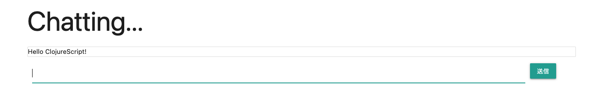

# chat-cljs(minimal clojureScript chat app)
Super minimal app made by ClojureScript. 



ClojureScript has interoperability with node.js and npm modules, so this project try to build web app by npm module(Express.js and related http libraries).

For that purpose, the chat app has a limited functions like only chatting, checking text.

# Get started
## Prerequisite
- node.js > 6.x
- java > 8

## Build, Boot
After cloning repository, it can be booted like below:
```bash
npm i

npm run watch
```

This app is build by `shadow-cljs`, so first of all we have to install dependencies.

`npm run watch` builds and watches `.cljs` and an artifact is `core.js`. To boot this, run by `node` and access to a browser, `http://localhost:3000`

```bash
node core.js
```
